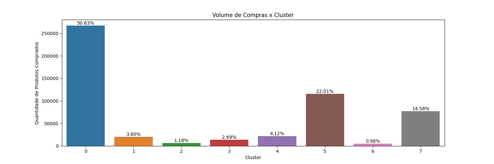
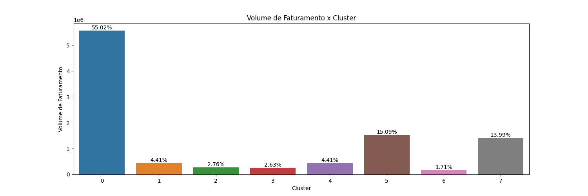
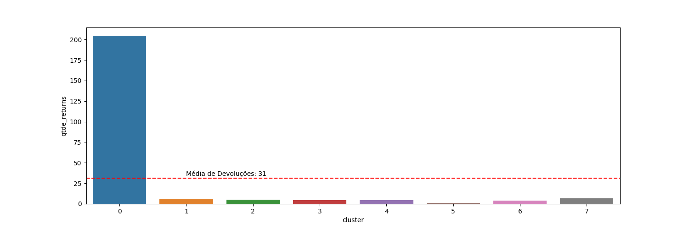
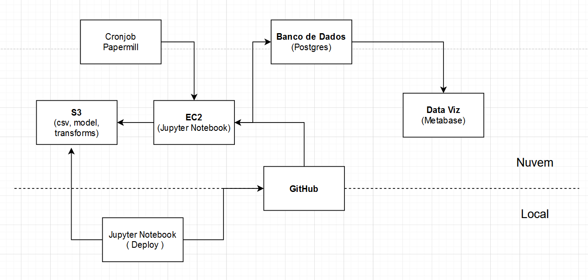
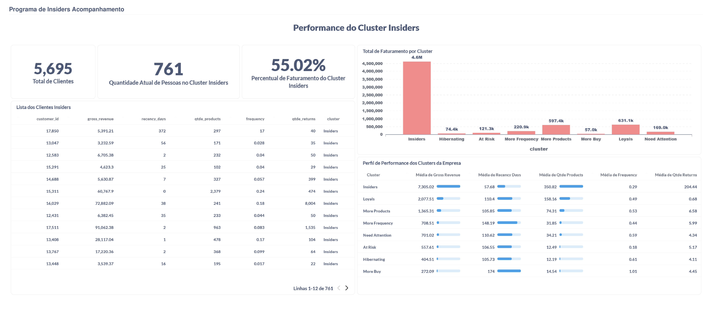

# Insiders Clustering

## Clustering Project

#### This project was made by Luan Maieski.

# 1. Problema de Negócio.
A empresa All In One Place é uma empresa Outlet Multimarcas,que comercializa produtos de segunda linha de várias marcas a um preço menor, através de um e-commerce.

Em um pouco mais de 1 ano de operação, o time de marketing percebeu que alguns clientes da sua base, compram produtos mais caros, com alta frequência e acabam contribuindo com uma parcela significativa do faturamento da empresa.

Baseado nessa percepção, o time de marketing vai lançar um programa de fidelidade para os melhores clientes da base, chamado Insiders. Mas o time não tem um conhecimento avançado em análise de dados para eleger os participantes do programa.

Por esse motivo, o time de marketing requisitou ao time de dados uma seleção de clientes elegíveis ao programa, usando técnicas avançadas de manipulação de dados.

# 2. Business Assumptions.
### Data
Descrição dos dados que serão usados nesse projeto:

|Variável|Definição|
| -- | -- |
|InvoiceNo|Identificador único de cada transação|
|StockCode|Código identificador de cada produto|
|Description|Descrição do produto|
|Quantity|Quantidade de produtos comprados em cada transação |
|InvoiceDate|Data da transação|
|UnitPrice|Preço unitário de cada produto|
|CustomerID| Identificador único de cada cliente|
|Country|País do cliente|

### Premissas
Para o desenvolvimento do projeto foram tomadas algumas ações nos dados:
* Foram atribuidos ID's aos clientes que não possuíam
* Foram removidas amostras que tinham preço menor que 0.04
* Foram removidas amostras em que o StockCode tinha ['POST', 'D', 'DOT', 'M', 'S', 'AMAZONFEE', 'm', 'DCGSSBOY', 'DCGSSGIRL', 'PADS', 'B', 'CRUK'], pois não tem como deduzir seu significado.
* Foram removidos clientes com Country igual a 'European Community' e 'Unspecified'
* Produtos com quantidade menor que 0 foram considerados estornos.

# 3. Solution Strategy

A estratégia para fazer esse projeto teve como base a metodologia CRISP-DS seguindo as etapas descritas abaixo:

**Step 01. Data Description:**
* Coletar os dados na AWS S3.
* Fazer a descrição dos dados; renomear colunas; verificar os tipos de dados e se tem dados faltantes; substituir os dados faltantes e mudar o tipo dos dados se necessário.
* Estatística descritiva para identificar possíveis problemas nos dados.

**Step 02. Data Filtering:**
* Filtrar os dados, removendo dados que não trarão nenum ganho de informação; remover dados que não fazem sentido para o negócio.

**Step 03. Feature Engineering:**
* Criação de novas features para ajudar no aprendizado do modelo e responder as questões de negócio. 

**Step 04. Exploratory Data Analysis:**
* Análise Univariada com o Pandas Profiling, para ver a variabilidade das features e verifcar se tem outliers.
* Análise Bivariada para identificar graficamente a variabilidade das features.

**Step 05. Data Preparation:**
* Fazer as transformações necessárias para o aprendizado do modelo.

**Step 06. Estudo do Espaço:**
* Realizar o estudo do espaço craindo embeddings que mostrem os dados de uma forma mais organizada

**Step 07. Hyperparameter Fine Tunning:**
* Treinar os modelos de machine learning com diferentes valores de K(cluster)
* Avaliar a performance com a métrica SS(Silhouette Score) para ver o melhor valor de K 
* Comparar o resultado dos modelos e escolher o modelo e o valor de K que tem a melhor performance e que possa ajudar nas decisões de negócio

**Step 08. Machine Learning Modelling:**
* Treinar o algoritmo escolhido, com o número de k escolhido, no espaço escolhido

**Step 09. Convert Model Performance to Business Values:**
* Criar tabela dos clientes por grupo.
* Identificar as características de cada grupo.

**Step 10. Business Questions:**
* Criar o MindMap de Hipóteses
* Criar e validar as hipóteses que tem dados disponíveis
* Responder as perguntas de negócio

**Step 10. Deploy Modelo to Production:**
* Inserir os dados da tabela de clientes no banco de dados AWS RDS.
* Testar o Notebook final em ambiente local
* Criar o servidor AWS EC2 e mandar o projeto através do github
* Criar o processo automatico de execução  com o papermill e conectar o banco RDS ao Metabase.
* Criar Dashbord no Metabase.

# 4. Top 3 Data Insights

|**Hypothesis 01:** Os clientes do cluster insiders possuem um volume (produtos) de compras acima de 10% do total de compras. | 
| -------- |
| **True:** Os cluster insiders possuem um volume de compra de produtos de 50% | 
|  |
 

|**Hypothesis 02:** Os clientes do cluster insiders possuem um volume (faturamento) de compras acima de 10% do total de compras. |
| -------- |
| **True:** O cluster insiders possuem um volume de GMV de 55% |
|  |
 

|**Hypothesis 03:** Os clientes do cluster insiders tem um número de devolução abaixo da média da base total de clientes. |
| -------- |
| **False:** O cluster insiders tem média de devoluções acima da média geral | 
|  |

# 5. Machine Learning Model Applied
Antes de testar os algoritmos fiz o estudo do espaço onde usei as técnicas de redução de dimensionalidade - PCA, UMAP, t-SNE e Tree-Based Embedding - para deixar os dados em um espaço com clusters mais organizados e separados. Nesse estudo a técnica com melhor desempenho foi a Tree-Based Embedding, que foi escolhida para então treinar os modelos.

Para a clusterização dos clientes foram testados 4 modelos de Machine Learning: 
K-Means, Gaussian Mixture Model(GMM), Hierarchical Clustering(HC), DBSCAN

A métrica de avaliação dos modelos foi a Silhouette Score. Ela mede o quão bem os pontos estão separados dentro dos clusters em comparação com a separação entre os clusters. Ela vaia de -1 a 1 e quannto mais próxima de 1, melhor é o número de clusters.

Os modelos foram treinados para valores de K de 2 até 25. Apesar de os melhores resultados terem dado com K próximo ao máximo, para a aplicação no negócio não faria sentido tantos clusters então levando em conta a possibilidade de uso pelo time de negócio e os melhores resultados da métrica de performance, o algoritmo escolhido foi o K-Means com 8 Clusters, com uma Silhouette Score de 0.45.

# 6. Deploy
O Processo de deploy do projeto teve os seguintes passos:
- Criei um Bucket no S3(Simple Storage Server) para armazenar os dados brutos dos clientes.
- Fiz todos os estudos, analises e treinamento do modelo de ML com o Jupyter Notebook local e mandei o projeto em um repositório no GitHub.
- Com o Notebook local salvei todas as transformações de encoding, embedding e modelo treinado no Bucket no S3.
- Criei um servidor virtual Amazon EC2 onde clonei o reposítório do GitHub.
- Fiz um Notebook rodando com todas as transformações salvas do S3, salvando o resultado em um banco de dados Postgres criado no RDS da Amazon .
- Com o Papermill configurado para rodar o Notebook automaticamente.
- Conectei o banco de dados no metabase e fiz o Dashboard de acompanhamento do Cluster Insiders.

# 7. Final Product
A lista com os clientes do grupo Insiders pode ser vista [aqui](reports/Insiders_final_list.csv)

# 7. Conclusions
O objetivo de obter uma seleção de clientes mais valiosos para a empresa foi cumprido. As perguntas de negócio foram respondidas no [notebook](src/models/c10-deploy.ipynb) e também podem ser acompanhadas no Dashboard. Com as questões respndidas, o dashboard e os insights gerados, o time de marketing poderá tomar ações acertivas e gerar melhores resultados para a empresa.

# 8. Lessons Learned
- O funcionamento dos modelos de Clusterização e algumas métricas de avaliação dos modelos.
- Estudo do espaço e redução de dimensionalidade, Embeddings.
- Implementar um projeto na nuvem AWS usando vários serviços.
- Criar Dashboard na ferramenta Metabase

# 9. Next Steps to Improve
- Em um próximo ciclo:
    - Testar uma função de otimização para achar os melhores hiperparâmetros e treinar o DBSCAN
    - Testar novas técnicas de mudança de espaço das features
    - Adquirir mais informações do negócio para poder gerar mais insights.
    - Melhorar o Dashboard de acompanhamento com mais informações relevantes.
    
# LICENSE

# All Rights Reserved - Comunidade DS 2023
